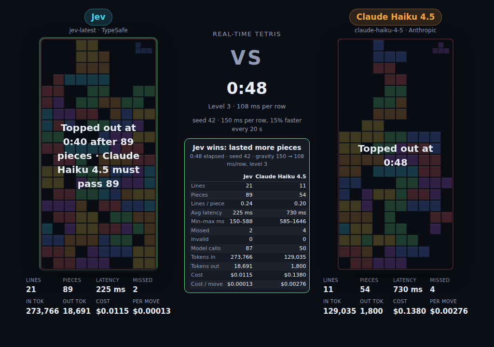
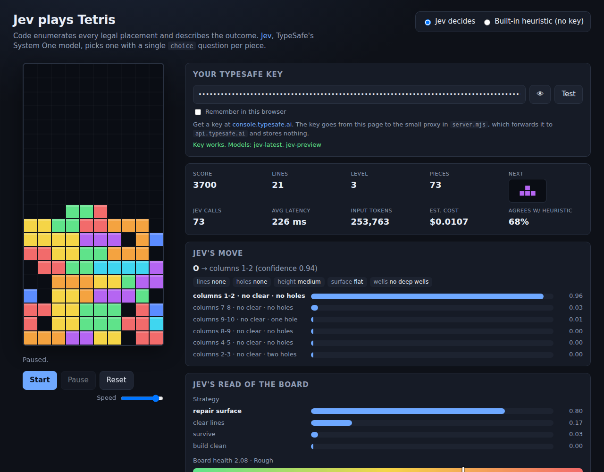

# Jev vs Claude Haiku: real-time Tetris

Two AI models play Tetris against each other in real time. [Jev](https://docs.typesafe.ai), TypeSafe's
System One model, faces Claude Haiku 4.5. Same piece sequence, same options, same clock. Every line you
clear lands on your opponent's board as a garbage row. Whoever tops out first loses.

**Play it live:** [jev-tetris.vercel.app](https://jev-tetris.vercel.app)
(bring a TypeSafe key and an Anthropic key; the proxy stores nothing).



## The battle

Each side runs its own real-time game loop on a seeded piece sequence shared by both players.

- **Decisions under a falling piece.** When a piece spawns, the model is asked at once. Meanwhile
  gravity pulls the piece down one row every N ms. When the answer arrives, the piece slides to the
  chosen column and rotation and hard-drops. If it lands before the answer arrives, it locks where it
  is: a missed deadline.
- **Gravity rises over time** on a schedule both sides share. Default: 150 ms per row, 15% faster
  every 20 seconds, floor 40 ms. The level shows under the clock. Gentle, brutal and constant
  schedules are selectable.
- **Versus.** Every cleared line becomes a garbage row (full except one gap) queued for the opponent
  and inserted under their stack when their current piece locks. A red counter shows incoming rows.
  If the push shoves the stack out of the top, that player is out, and the first to top out loses.
- **Same information for both.** Code enumerates every legal placement and describes each outcome in
  words (lines cleared, holes created, height, surface, wells). Jev answers with a Choice question
  over those options; Haiku answers through a forced `place_piece` tool whose `option_id` is an enum
  of the same options. Both are constrained to legal moves; latency is part of the game.
- **Stats per model.** Lines, pieces, garbage sent and received, average and min/max latency, missed
  deadlines, invalid answers, model calls, tokens in and out, cost and cost per move, live under each
  board and in a side-by-side table when the match ends.

Untick the versus box and the boards become independent; since a faster player cycles through more
pieces per minute, the survivor then has to outlast the loser's piece count to win. The "wait for
answers" toggle removes gravity so only decision quality is compared. Append `?present` to the URL
for a stripped-down layout meant for recordings.

### Results so far

Seed 42, one run each. Jev is not fully deterministic between runs, so treat these as samples.

| Mode | Result | Jev | Claude Haiku 4.5 |
| --- | --- | --- | --- |
| Versus, gravity 150 ms/row rising 15% every 20 s | Jev wins at 0:17: Haiku topped out first | 10 lines, 34 pieces, sent 10 garbage, 216 ms/move, 0 missed, $0.004 | 4 lines, 21 pieces, sent 4 garbage, 700 ms/move, 2 missed, $0.053 |
| Independent boards, same gravity | Jev wins: out at 97 pieces, Haiku out at 61 | 25 lines, 243 ms/move, 2 missed, $0.013 | 15 lines, 721 ms/move, 6 missed, $0.155 |
| Lockstep (no gravity) | Jev wins, survived more pieces | 52 lines, 167 pieces, 219 ms/move, $0.022 | 28 lines, 106 pieces, 832 ms/move, $0.301 |

Jev answers in about 220 ms and Haiku in about 750 ms, so Jev clears lines roughly twice as fast in
wall-clock terms. In versus mode that gap turns into garbage: Haiku's board fills from below faster
than it can clear from above. Missed deadlines bite both sides as the stack rises, because near the
top a piece has only a few rows to fall. Per move, Jev costs about 20x less: its input tokens are
cheap and its output is free, while Haiku bills both directions.

## Single player: Jev on its own

[jev-tetris.vercel.app/solo.html](https://jev-tetris.vercel.app/solo.html) shows one Jev game with
every decision explained: the chosen placement with confidence, the alternatives with their probabilities drawn as
ghost outlines on the board, Jev's read of the board (strategy, health, whether the next piece has a
clean spot), token usage, cost, and the raw request and response.



Jev is not a text generator or a planner. It answers typed questions about a piece of state and
returns calibrated probabilities, so the split of work follows TypeSafe's
[building guide](https://docs.typesafe.ai/concepts/how-to-build-with-system-one): code owns the
game, Jev supplies the judgment.

1. **Code enumerates every legal placement**, simulates it, and computes the outcome. See
   [`public/tetris.js`](public/tetris.js).
2. **Code turns the numbers into words.** Jev reads text and is weak at arithmetic
   ([jaggedness notes](https://docs.typesafe.ai/model-jaggedness/jev-1.13)), so each placement becomes
   a small object with the same fields on every option: `lines_cleared: "two lines"`,
   `holes_created: "none"`, `stack_height_after: "low"`, `surface_after: "flat"`, and so on.
3. **One request to `POST /v1/systemone`** carries the board as state plus four questions
   ([speculative fan-out](https://docs.typesafe.ai/patterns/fan-out)). See [`public/jev.js`](public/jev.js).

   | Question | Type | What it does |
   | --- | --- | --- |
   | `placement` | Choice over every placement | Drives the game. The chosen option is dropped. |
   | `strategy` | Choice (`build_clean`, `clear_lines`, `repair_surface`, `survive`) | Shown as Jev's game plan. |
   | `board_health` | Score over four levels | Shown as a gauge. |
   | `next_piece_fits` | Noul | Shown as a probability bar. |

4. **Code acts on the answer.** The chosen placement is animated and locked. A classic hand-tuned
   heuristic runs alongside, and the panel shows how often Jev agrees with it.

Each move is one request of roughly 2,500 to 4,000 input tokens. A 150-piece game measured about
240 ms per move and roughly 530k input tokens, about two cents at the published price. Observed play:
50 lines over 150 pieces without topping out, 69% agreement with the heuristic. Jev takes single-line
clears readily and tolerates holes more than the heuristic does; the `priorities` list in
`public/jev.js` is where to push it toward cleaner play. No key? Switch to the built-in heuristic to
watch the code-only player.

## Run it yourself

Requires Node.js 20 or newer. There are no dependencies.

```sh
npm start
# open http://localhost:3000 (battle) or http://localhost:3000/solo.html (single player)
```

Or deploy your own copy to Vercel; the repo ships `api/` functions that act as the proxy:

[](https://vercel.com/new/clone?repository-url=https%3A%2F%2Fgithub.com%2Ftrungdq88%2Fjev-tetris&project-name=jev-tetris&repository-name=jev-tetris)

Any host that runs `npm start` on a Node 20+ box works too.

### Why there is a server

`api.typesafe.ai` rejects browser origins (CORS), so the page cannot call it directly.
[`server.mjs`](server.mjs) serves the static files and forwards `POST /api/systemone`,
`GET /api/models` and `POST /api/anthropic` to TypeSafe and Anthropic with the key the page sent
in the request. It keeps no state and never logs a key. The same logic runs as Vercel functions
in `api/`.

Optional environment variables:

| Variable | Meaning |
| --- | --- |
| `PORT` | Port to listen on. Default `3000`. |
| `TYPESAFE_API_KEY` | If set, visitors who leave the TypeSafe key blank use this key. Leave unset for a public deployment. |
| `TYPESAFE_API_BASE` | Override the TypeSafe API base URL. |
| `ANTHROPIC_API_BASE` | Override the Anthropic API base URL. |

Behind a corporate proxy, run with `NODE_USE_ENV_PROXY=1` so Node's `fetch` honours `HTTPS_PROXY`.

## Tests

```sh
npm test
```

Unit tests cover the engine (placement enumeration, line clears, hole counting, garbage rows, seeded
piece sequences) and the request builders (one criteria entry per placement, stable field names,
answer mapping, the Haiku tool schema and reply parser).

## Files

```
server.mjs            local static server + proxies
lib/typesafe.mjs      TypeSafe proxy logic shared by server.mjs and api/
lib/anthropic.mjs     Anthropic Messages API proxy for the battle
api/*.js              the same proxies as Vercel serverless functions
vercel.json           Vercel config (static public/, functions in api/)
public/index.html     battle page (+ battle.css, battle.js)
public/players.js     Jev and Claude Haiku players for the battle
public/solo.html      single-player page (+ style.css, app.js)
public/battle.html    redirect to the front page for old links
public/tetris.js      pure engine: pieces, placements, outcome descriptions, garbage, seeded RNG
public/jev.js         Jev request builder, API call with retry, answer mapping
test/tetris.test.mjs  node --test suite
```

## Tuning

Everything Jev sees is in `buildState` and `buildQuestions` in [`public/jev.js`](public/jev.js);
Haiku's system prompt and tool are in [`public/players.js`](public/players.js). The `priorities`
list inside Jev's `placement` question is where to change how it weighs line clears against holes
and height. The word buckets for each feature live in the `describe*` helpers in
[`public/tetris.js`](public/tetris.js). Keep the numbers in code and hand the models the comparison.
